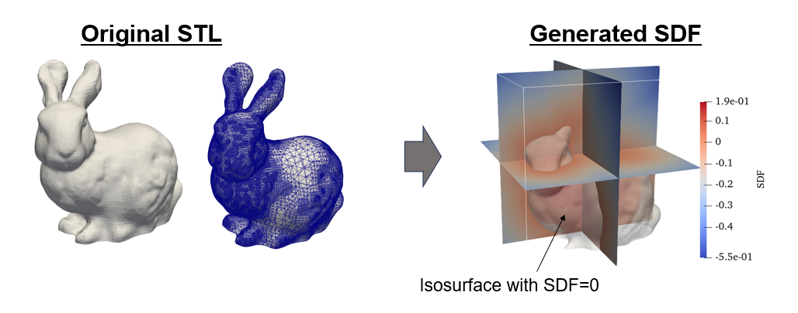

# sdfGenerator
sdfGenerator is a C++ header-only library for computing the signed distance function (SDF).

## Currently available features

* Generate SDF from STL using CUDA

## Example

See [example/main.cu](./example/main.cu).

Note: To run [example/main.cu](./example/main.cu), compile with

```
make
```

and run the generated executable file `a.out.`

```
./a.out
```

In this example, the SDF is calculated from the STL file [example/Stanford_Bunny.stl](./example/Stanford_Bunny.stl) (downloaded from [here](https://commons.wikimedia.org/wiki/File:Stanford_Bunny.stl?uselang=ja)) and output the result to the file `bunny.vtk`.
The results can be visualized in paraview.


