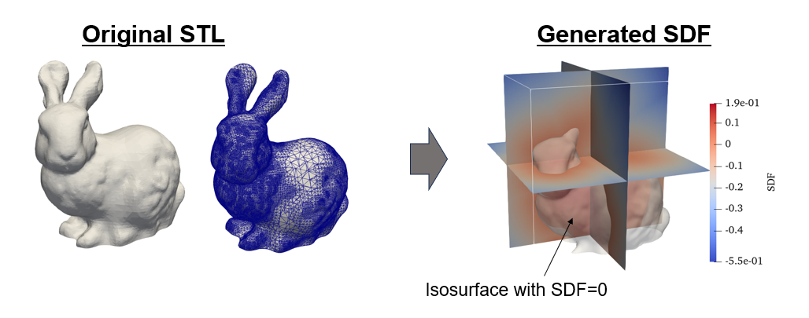
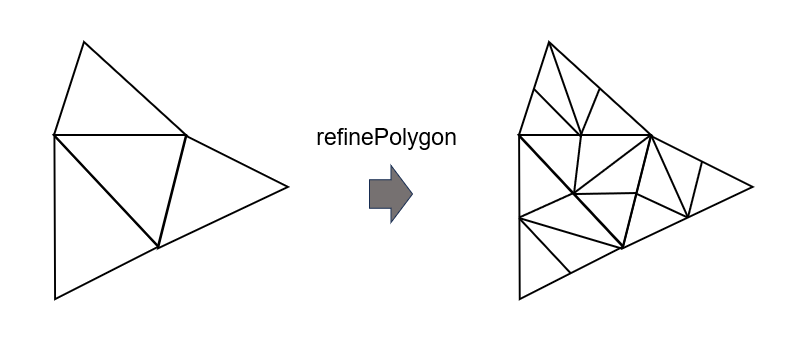

# Generate SDF (Signed Distance Function) from STL

## Overview

The sdfGenerator library provides functionality to generate a Signed Distance Function (SDF) from an STL file.

An STL (Stereolithography) file represents a 3D shape as a collection of triangular facets.  
These facets define the surface of the 3D model, and the SDF calculation determines the signed distance of points in 3D space to the closest surface of the model.

The example shown in the figure illustrates the SDF calculated at each grid point of a 3D Cartesian grid from [Stanford_Bunny.stl](https://commons.wikimedia.org/wiki/File:Stanford_Bunny.stl?uselang=ja).



## Steps to Generate SDF

### Include Necessary Headers

To use the functionality provided by the library, include the following headers:
```cpp
#include <sdfGenerator/STL.h>
#include <sdfGenerator/stl_to_sdf.h>
```

### Prepare Points to Calculate SDF

The number of points where the SDF will be calculated is denoted by $N$.  
These points represent the locations in 3D space where you want to determine the signed distance.  
Prepare arrays that store the coordinates of each point $(x, y, z)$.  
The library does not enforce a specific data type for these arrays, but it is recommended to use `float` because the STL format itself stores data in `float` precision.

```cpp
constexpr size_t N = 1000000; // Number of points

// Arrays to store coordinates
float *x = new float[N];
float *y = new float[N];
float *z = new float[N];

// Set coordinate at each point.
for (size_t index = 0; index < N; index++)
{
    x[index] = /* x-coordinate at this point */;
    y[index] = /* y-coordinate at this point */;
    z[index] = /* z-coordinate at this point */;
}
```

### Load the STL File

Create an instance of the `sdfGenerator::STL` class.
```cpp
sdfGenerator::STL stl;
```
The `sdfGenerator::STL::readSTL()` function reads the triangular facets from the file into the library’s internal data structures.  
When loading STL, you can change the coordinates of the triangle elements by using

* $s$: `scale_factor` ($1$ by default)
* $\vec{o}$: `offset` ($(0, 0, 0)$ by default)

The new coordinates of the triangular elements are calculated as follows:

$$
(x, y, z) _\mathrm{new}= (x, y, z) _\mathrm{original} \times s + \vec{o}.
$$

Here are some examples of how to load STL files:

```cpp
stl.readSTL( "./example.stl" ); // scale_factor = 1, offset = (0, 0, 0)
```
```cpp
const float offset[3] = {3e-3, 1e-3, 4e-3};
stl.readSTL( "./example.stl", offset ); // scale_factor = 1
```
```cpp
const float scale_factor = 1.5
stl.readSTL( "./example.stl", scale_factor ); // offset = (0, 0, 0)
```
```cpp
const float scale_factor = 1.5
const float offset[3] = {3e-3, 1e-3, 4e-3};
stl.readSTL( "./example.stl", offset, scale_factor );
```

### Refine polygons

If the sizes of the triangular elements are large, the accuracy of the SDF calculation decreases.  
The `sdfGenerator::STL::refinePolygon` function refines all triangular elements such that the longest edge of each triangle is smaller than or equal to the specified threshold.  
This process involves subdividing the triangles into smaller triangles while preserving the original geometry.  

```cpp
const float threshold = 1e-5;
stl.refinePolygon( threshold );
```

### Allocate an Array for SDF Results

Prepare an array to store the calculated SDF values.  
`sdf[i]` corresponds to the SDF of a point whose coordinate is (`x[i]`, `y[i]`, `z[i]`).
```cpp
float *sdf = new float[N];
```

### Calculate the SDF
Use the `sdfGenerator::gpu::stl_to_sdf()` function to compute the SDF values.  
This function performs the necessary computations and fills the `sdf` array with the signed distances.
```cpp
sdfGenerator::gpu::stl_to_sdf( sdf, x, y, z, N, stl );
```
